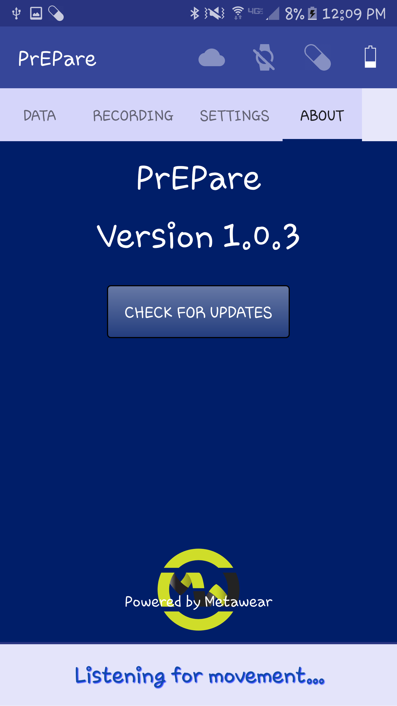

# PrEPare : Data Collection

## Version 1.1.0.

## Introduction

PrEPare tracks pill intake by interfacing with a smart pill bottle cap equipped with a [Metawear C](https://mbientlab.com/metawearc/), which contains a 6-axis inertial measurement unit (IMU): accelerometer and gyroscope. The user may optionally be equipped with a smartwatch that supports Android Wear in order to additionally track the wrist trajectory and the watch-to-bottle RSSI (received signal strength indicator), which provides useful proximity estimates. The primary intent is to help HIV+ patients follow their daily pill intake regiment; however, this system may be advantageous to anyone who might need help remembering to take their daily pills.

## Background

Pre-exposure Prophylaxis, known as PrEP, is a medication that can prevent HIV infection and is generally provided to those who are at substantial risk e.g. due to genetic predisposition, drug use or sexual preference. Although PrEP significantly reduces the risk of infection, by up to 92%, it is essential that it be taken consistently. See [http://www.cdc.gov/hiv/risk/prep/](http://www.cdc.gov/hiv/risk/prep/).

On the other hand, those who have already contracted HIV may be subject to take as many as 15 pills daily for effective treatment. The FDA has approved more than 25 drugs available for treatment. A comprehensive list can be found [here](http://www.healthline.com/health/hiv-aids/medications-list#4).

## Getting Started

To install the current release version of PrEPare, navigate [here](https://drive.google.com/uc?export=view&id=0Byr6oHEGQO73Q0laWURLM3hZbHM) from your mobile phone. The mobile release .apk file bundles the wear installation as well.

You must have a [Metawear C](https://mbientlab.com/metawearc/) board in order to use the application.

## Screenshots




## Sensor Data

The following sensors are available through the application.

  * Accelerometer/Gyroscope from the Metawear C
  * Accelerometer/Gyroscope from the Android Wear
  * RSSI (Received Signal Strength Indicator) between the Metawear C and Android Wear/Phone as a proxy for proximity
  * Video/Audio from the mobile device for reliable annotation

Any of the sensors can be disabled through the shared preferences accessible from the settings tab on the mobile application. Alternatively, long pressing the corresponding icon in the status bar will enable/disable that particular device. Additionally, all enabled sensors can run in the background, allowing the user to continue with ordinary phone usage during data collection.

## Data Persistence

Data can be stored either locally in external storage or sent to a remote server, as specified in the Storage settings.

## Application Permissions

There are no required application permissions. Much application functionality, however, does rely on several permissions.

  * [```WRITE_EXTERNAL_STORAGE```] (https://developer.android.com/reference/android/Manifest.permission.html#WRITE_EXTERNAL_STORAGE) is required to write data to disk. This permission is therefore required to record video and is requested upon pressing the record button. Additionally, this permission is required if the user enables 'Write data locally' in the Storage settings.
  * [```ACCESS_COARSE_LOCATION```](https://developer.android.com/reference/android/Manifest.permission.html#ACCESS_COARSE_LOCATION) is since Android version 6.0 required to scan for Bluetooth Low Energy devices. This permission will be requested upon initial launch and whenever the user selects the device in the general settings. If disallowed, the user may alternatively choose to enter the MAC ID of the Metawear device manually, in the form *#*#*.*#*#*.*#*#*.*#*#*.*#*#*.*#*#*.
  * [```CAMERA```](https://developer.android.com/reference/android/Manifest.permission.html#CAMERA) is required if the user wishes to record video within the application.
  * [```RECORD_AUDIO```](https://developer.android.com/reference/android/Manifest.permission.html#RECORD_AUDIO) is required if when requesting to record video, audio recording is enabled.
  * [```SYSTEM_ALERT_WINDOW```](https://developer.android.com/reference/android/Manifest.permission.html#SYSTEM_ALERT_WINDOW) is a special permission that allows the application to draw over all other applications. It is required to record video, because video recording is done in a background service, such that the recording will continue even when the application is closed or the recording tab is not visible. If the permission is disallowed, then video will not be recorded. In future releases, the user will be able to deny this permission and continue to record video, in which case when the application is paused or stopped, the video will stop automatically.

## Troubleshooting

  * *There seems to be a delay in the data streaming? After disabling the service, it continues to run for several seconds.*
    This may occur when running the Metawear service over Android wear, especially if both accelerometer and gyroscope sensors are enabled. Make sure that (1) the rates of the sensor data coming from the Metawear device total no more than 100Hz, (2) no other Android wear applications with high Bluetooth bandwidth requirements are running and (3) the battery levels on all devices are above 10%.
  * *I can't connect to the Metawear board when I move it.*
    If the board was ungracefully disconnected, e.g. if the mobile or wearable device battery died, then the motion detection may not have been re-enabled. An easy fix is to press the white button on the board. This will send out a Bluetooth connection, just as if it had detected motion, allowing the phone or wearable to reconnect to it. If the problem persists, try removing and re-inserting the Metawear battery, disabling and re-enabling the pill bottle from the application settings, or re-installing the application on either or both devices.
  * *I can't connect to the data collection server.*
    Make sure that the IP address is properly set in the Storage settings. The server must be running on port 9999 of the machine with the specified IP address. Make sure you have a network connection. If the server does not have an outward facing port, then you must additionally be connected to the same network as the server. Network security or Firewall settings may also block connection attempts.

#### Low-Power Data Collection

Using several sensing modalities simultaneously poses the issue of high power consumption. However, notice that the data collection is distributed among three dedicated devices.

  1. The phone handles the user interactions, application preferences, the video recording service and the Bluetooth connection with the wearable.
  2. The Android wear handles basic user interactions and notifications, accelerometer and gyroscope streaming, the Bluetooth connection with the Metawear device and the sensor data transmission to the phone.
  3. The Metawear device handles only its own accelerometer and gyroscope data, sending them periodically to the smartwatch.

To reduce the power consumption on the Metawear board, data collection will only be initiated when the device detects motion. Otherwise the board will remain in low-power motion detection mode with Bluetooth signaling disabled. When the board detects motion, it re-enables Bluetooth, allowing it to establish a connection with the phone, enables the accelerometer and any other desired sensors and listens for no-motion events. When the board has not moved for several seconds, it will disconnect from the phone and re-enter low-power motion mode.

While in low-power motion mode, the Metawear board is estimated to last at least one year on a single CR-2032 coin cell battery. While streaming the data to the phone, it is estimated to last close to 100 hours.

To reduce the daily power consumption of the Metawear and the Android wear, it is recommended that the gyroscope is disabled. The gyroscope consumes two orders of magnitude greater power than the accelerometer and offers minimal boost in performance.

